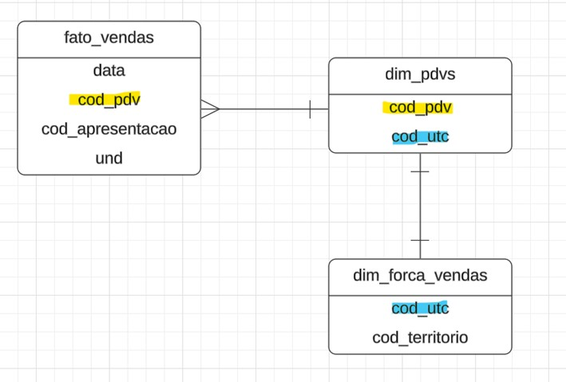
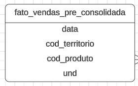
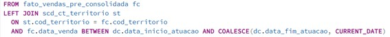
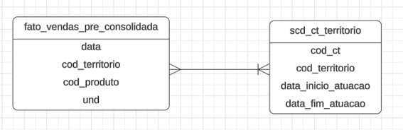
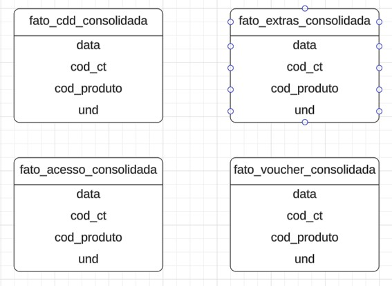
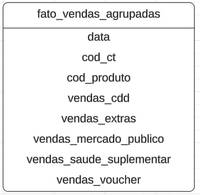

# Fonte de Dados

## Tabelas Necessárias (Diretamente)

### 1. Fato Vendas
**Colunas:**
- Data da Venda  
- Código do Consultor Técnico (`cod_ct`)  
- Código do Produto (`cod_produto`)  
- Unidades Vendidas  

### 2. Fato Meta
**Colunas:**
- Data (Mês da Meta)  
- Código do Consultor Técnico (`cod_ct`)  
- Código do Produto (`cod_produto`)  
- Unidades Meta  

### 3. Dimensão CT
**Colunas:**
- Código do Consultor Técnico (`cod_ct`)  
- Nome do Consultor Técnico (`nome_ct`)  
- Data de Admissão  
- Data de Demissão  

### 4. Dimensão GR
**Colunas:**
- Código do Gerente Regional (`cod_gr`)  
- Nome do Gerente Regional (`nome_gr`)  
- Data de Admissão  
- Data de Demissão  

### 5. SCD (Slow Changing Dimension) Nível do CT
**Colunas:**
- Código do Consultor Técnico (`cod_ct`)  
- Nível  
- Data de Início do Nível (`data_inicio_nivel`)  
- Data de Fim do Nível (`data_fim_nivel`)  

### 6. SCD (Slow Changing Dimension) Nível do GR
**Colunas:**
- Código do Gerente Regional (`cod_gr`)  
- Nível  
- Data de Início do Nível (`data_inicio_nivel`)  
- Data de Fim do Nível (`data_fim_nivel`)  

### 7. SCD Bônus CT
**Colunas:**
- Data (Mês de Vigência dos Valores)  
- Nível  
- Bônus Meta 1  
- Bônus Meta 2  
- Bônus Meta 3  

### 8. SCD Bônus GR
**Colunas:**
- Data (Mês de Vigência dos Valores)  
- Nível  
- Bônus Meta 1  
- Bônus Meta 2  
- Bônus Meta 3  

---

## Tabelas Necessárias (Indiretamente)

### 1. SCD CT Território
**Colunas:**
- Código do Consultor Técnico (`cod_ct`)  
- Código do Território (`cod_territorio`)  
- Código do Gerente Regional (`cod_gr`)  
- Data de Início da Atuação no Território (`data_inicio_atuacao_territorio`)  
- Data de Fim da Atuação no Território (`data_fim_atuacao_territorio`)  

---

## Obtenção da Tabela de Vendas Consolidada

### Objetivo  
Consolidar todas as vendas em uma única tabela unificada, contendo dados de múltiplas fontes, com as seguintes colunas principais:  
- Data da Venda  
- Código do Consultor Técnico (`cod_ct`)  
- Código do Produto (`cod_produto`)  
- Unidades Vendidas  

### Fontes de Dados  
- Vendas CDD  
- Vendas Extras  
- Vendas Mercado Público e Saúde Suplementar  
- Vendas Vouchers (considerando apenas vendas com desconto acima de 99%)  

### 1º Passo – Padronização de cada tabela de vendas  
Neste passo, foi realizado um processo de padronização em cada uma das tabelas de vendas (CDD, Extras, Acesso e Vouchers) com o objetivo de gerar a coluna cod_territorio. Essa coluna é essencial para determinar o CT responsável por cada venda.

## Observações Importantes:

1. **Tabela de Vendas CDD**  
   - Foram excluídas as vendas do canal **HOSPITALAR**.  
   - Também foram removidas as vendas cujos informantes pertencem às categorias **DIMED, LS e PORTAL**.  

2. **Tabela de Vendas VOUCHER**  
   - Foram mantidas apenas as vendas que apresentam **desconto superior a 70%**.  
   - Para vouchers de **99.99%**, descontamos **1 voucher por uma venda**.  
   - Para vouchers entre **70% e 80%**, descontamos **2 vendas a cada 3 vouchers**, ou seja, **1 voucher de 70% equivale a 2/3 de uma venda**.  

## Resultado Final

Ao final deste passo, cada tabela foi ajustada para conter apenas os dados relevantes, resultando na seguinte estrutura padrão:

## 2º Passo: Atribuição do CÓDIGO CT às Vendas

No passo anterior, foram geradas quatro tabelas (**CDD, Extras, Acesso e Vouchers**) no formato da `fato_vendas_pre_consolidada`.  

Neste passo, o objetivo é **atribuir a coluna `cod_ct`**, garantindo que as vendas sejam computadas corretamente para o **Consultor Técnico (CT) responsável**, mesmo que o `cod_territorio` tenha mudado de CT ao longo do tempo. Essa abordagem é necessária para refletir as mudanças históricas de alocação dos territórios.  

Para atingir esse objetivo, utilizamos um **LEFT JOIN** entre a tabela `fato_vendas_pre_consolidada` e a dimensão `dim_ct_territorio`. Essa ligação é feita considerando **tanto o `cod_territorio` quanto o intervalo de datas**:  

- O `cod_territorio` da tabela fato é comparado com o da dimensão.  
- A **data da venda** é verificada para estar entre `data_inicio_atuacao` e `data_fim_atuacao` (ou a data atual, caso a saída não esteja definida).  

# Resultado Final

Ao final deste passo, cada tabela foi ajustada para conter apenas os dados relevantes, resultando na seguinte estrutura padrão:

## 3º Passo: Agrupamento das vendas por data e Concatenação das tabelas

Por fim, cada tabela fato foi agrupada por **data**, **cod_ct** e **cod_produto**, obtendo a soma das vendas. Em seguida, foram criadas as colunas **Nível** e **Tempo de Empresa**, referentes ao nível de tempo de empresa do CT no período filtrado.

## Por que foi necessário esse último passo?

Foi uma solução que eu encontrei para conseguir estabelecer um link entre o **CT** e a **dimensão calendário**.
